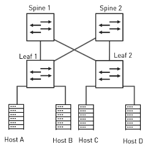

# DATA CENTER
---
- Facility used to house computer systems and associated components such as Compute, Network and Storage Systems
- Can be the size of a small Server Room to a few buildings Geographically distributed
- Critical business asset where companies run their workloads
- Requires **SCALABILITY**, **RESILIENCY**, **SECURITY** and **EFFICIENCY**

## DATA CENTER DESIGN
---
- Data Center Design is the process of planning all of a Data Center's essential Computational and Non-Computational parameters like
	- Number and Type of required Servers
	- Network Layout
	- Pow
	- er, Cooling and Ventilation Systems
	- Physical Data Center Security
	- Disaster Recovery
	- Business Continuity Planning

## NETWORK LAYOUT (TOPOLOGY)
---
- **NETWORK TOPOLOGY** : Schematic arrangement of Networking Elements such as Links and Nodes
- Describes how Devices are connected on the Network and how Data moves from one node to another
- **Key Considerations when choosing a Topology** :
	- **AVAILABILITY** :  
		- Enterprises need Maximum Availability of their Network Resources
		- Hardware, Software, Environmental and Power features contribute to overall Availability of the Network
		- Redundancy and Fault Tolerance
	- **RELIABILITY** :
		- in many of the industries, Downtimes and Delays are unacceptable
	- **PERFORMANCE** :
		- Topology of a Network determines its Performance
		- Choosing right Topology can increase performance while making it easier to locate faults, troubleshoot errors and effectively allocate resources across the network
	- **FUTURE GROWTH** : 
		- Network is expected to grow in size
		- Choose a Network Topology that is easy to add new Nodes without effecting the Performance or User Experience
	- **BUDGET** :
		- Choosing a Topology that perfectly suits your needs may not be Affordable
		- Effective and Affordable Topology needs to be considered

### HIERARCHICAL NETWORK DESIGN
---
- Separates a network into Distinct Layers where each layer has its role in the Network
- Most effective for North-South traffic patterns where majority of data goes in and out of the Data Center
- Scalability : Model Scales well because of its modularity but subject to bottlenecks if uplinks between layers are oversubscribed

#### MODERN DATA CENTERS
---
- Modern data centers are becoming more dependent on east-west traffic as more data moves between Servers and Storage nodes in order to meet end user demands
- Modern Data Server Requirements
	- Increased server-to-server communication
	- Scalability
	- Resiliency

### LEAF SPINE DESIGN
---
- Many data centers have transitioned to a leaf spine design to overcome the limitations of hierarchical design
- Leaf Spine Architecture is a two layer full mesh topology composed of a leaf layer and the spine layer
- Spine Switches connect the leaf switches with one another
- Leaf Switches connect servers to the network
- Leaf Switches are also referred to as Top of the Rack Switches (ToRs)
- Every leaf switch is connected to every spine switch
- Advantages of Leaf-Spine Architecture
	- Provides predictable and deterministic Latency
	- Improves Scalability
	- Improves Redundancy
	- Increases Bandwidth
	- Offer Congestion avoidance

#### THREE LEVEL LEAF SPINE DESIGN
---
- When the network reaches a certain scale, a third level of switches should be considered
- **SUPER SPINE or CORE** : Upmost level used to interconnect the spine switches

# LAYER 2 NETWORKS
---
- Networking Devices are configured for Switching - they make layer 2 forwarding decisions
- They build and maintain MAC Address table that maps MAC address to exit ports
- Switches process Ethernet Frames and firwards them based on the Destination MAC Address that matches against MAC Address table
- Layer 2 vs Layer 3
	- Lower Scalability
	- Lower Bandwidth
	- Lower Performance
	- Difficult to achieve redundancy and multipath support

## REDUNDANCY AND MULTIPATH SUPPORT
---
- Redundant Network Design
	- Allows for Network Availability by Duplicating elements such as Switches or Links so that if an element fails, critical applications are not disrupted
	- Eliminates any single point of failure in the network
- Multipath Support
	- Traffic forwarding to a single destination can occur over multiple paths
	- Increased bandwidth by load-balancing traffic over multiple paths

- Consider Host A communicates with Host C, the path is via Spine 1. When the link between Leaf 1 and Spine 1 fails, there is another available path via Spine 2 that can now be used for traffic forwarding. Idea of a redundant network design is that there is an active path and the backup path. If the active path fails, the backup path takes over.
- Since there are two available paths, using them at the same time will allow for load balancing the traffic, hence providing twice the bandwidth and better resource utilization. This is the advantage of multipath support. Multipath is a strategy where traffic forwarding to a single destination can occur over multiple paths. It can increase bandwidth by load-balancing traffic over multiple paths. However, it may be difficult to deploy it. 
